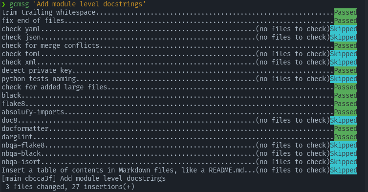

# Estimating behavioral parameters in animal movement models using a state-augmented particle filter

Projet pour le cours **Hidden Markov models and Sequential Monte-Carlo methods** de l'ENSAE.

* Gabriel Watkinson
* Gabriel Guaquiere
* Jérémie Stym-Popper
* Benjamin Maurel

## Introduction

Dans ce projet, nous implementons le modèle décrit dans le papier [Estimating behavioral parameters in animal movement models using a state-augmented particle filter](https://dalspace.library.dal.ca/bitstream/handle/10222/33464/Dowd_et_al-2011-Ecology.pdf), et l'approfondissons avec des méthodes plus récentes.

Pour aller plus loin, ce papier propose un algorithme plus récent: [Mixture Kalman filters](https://api.istex.fr/ark:/67375/WNG-STH7JZLH-T/fulltext.pdf?auth=ip,fede&sid=google,istex-view)

### Plan

* [ ] Récupérer/simuler les données
* [ ] Appliquer le papier aux données
* [ ] Appliquer SMC<sup>2</sup> aux données
* [ ] Appliquer Kalman aux données si on a le temps
* [ ] Comparer et critiquer les résultats

## Commandes

### Process des données

```python
python smc_movement_models/data_generation.py
# Pour plus d'informations
# python smc_movement_models/data_generation.py --help
```
### Styler le code R

```bash
# Rscript -e "install.packages(c('styler', 'lintr'))"  # pour installer les packages
Rscript -e "styler::style_file('original_code.R')"  # To format
Rscript -e "lintr::lint('original_code.R')"  # To lint
```


## Mise en place

Nous utilisons Python pour simuler les données et mettre en place les modèles, notamment la librairie [particles](https://github.com/nchopin/particles).

### Installation

Avant toutes choses, il faut se déplacer dans le dossier `smc_movement_models`:
```bash
cd /path/to/smc_movement_models
```

#### Avec [`poetry`](https://python-poetry.org/)
```bash
# Creation d'un environement virtuel et installation des packages
poetry install

# Activation de l'environement
poetry shell  # sub shell
# OU source $(poetry env info --path)/bin/activate  # activer l'environement dans le shell actuel
```

#### Avec `pip`
```bash
# Creation d'un environement virtuel
python -m venv .venv

# Activation de l'environement
.venv/Script/activate  # pour Windows
# OU source .venv/bin/activate  # pour Linux / MacOS

# Installation des packages
pip install -r requirements.txt
```

#### `pre-commit`

Pour activer les pre-commit qui formattent le code avant chaque commit :
```bash
pre-commit install
pre-commit run --all-files  # Pour installer les modules et lancer les tests
```



Pour forcer un commit sans vérifier :
```bash
git commit -m "..." --no-verify
```

### Architecture du projet

```bash
smc_movement_models
├── README.md
├── LICENSE
├── requirements.txt
├── environement.yml
├── images
│   └── ...
├── notebooks
│   └── first_implementation.ipynb
└── smc_movement_models
    ├── data_generation.py  # Sctipt to generate the data
    ├── models.py  # Implement the models
    └── main.py  # Main script to reproduce the experiments and plots
```
