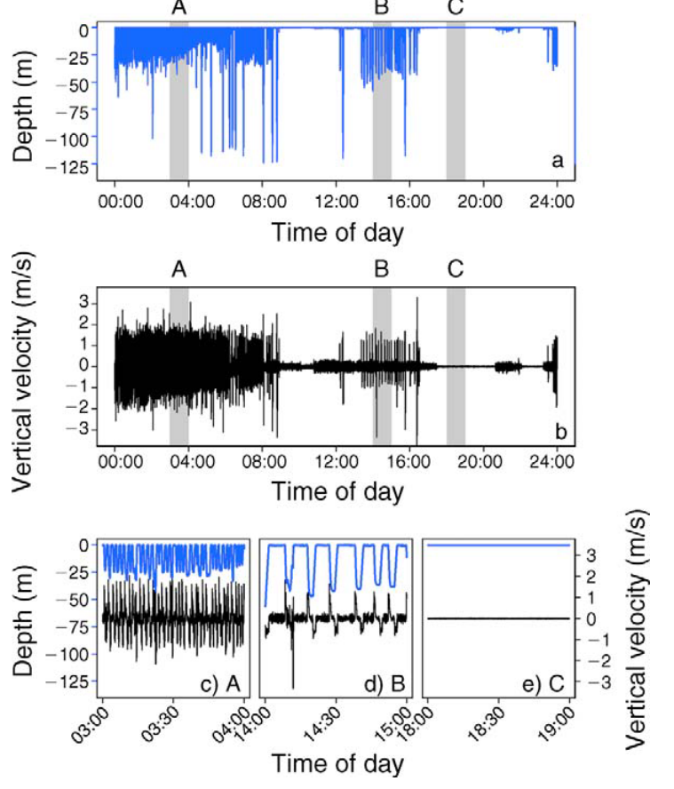

# Résumé rapide du premier papier

## Graphiques

### Données du papier

### Résultats du papier

## Equations

### State evolution equation

$$
\begin{equation}
    \bm{x}_t = \bm{f}(\bm{x}_{t-1}, \bm{\theta}_t) + \bm{n}_t
\end{equation}
$$
avec
* $\bm{x}_t$ un vecteur qui représente l'état de l'environement.
* $\bm{f}$ qui représente le modèle de mouvement.
* $\bm{\theta}_t$ le vecteur qui décrit le comportement du mouvement.
* $\bm{n}_t$ le bruit du système.

### Observation equation

$$
\begin{equation}
    \bm{y}_t = \bm{H} \bm{x}_t + \bm{e}_t
\end{equation}
$$
avec
* $\bm{y}_t$ le vecteur observé en $t$.
* $\bm{H}$ la matrice de conversion entre les états et la donnée observable.
* $\bm{e}_t$ l'erreur d'observation (qui suit une loi Gaussienne).

### Augmented state evolution equation

$$
\begin{equation}
    \begin{pmatrix}
        \bm{x}_t \\ \bm{\theta}_t
    \end{pmatrix}
    =
    \begin{pmatrix}
        \bm{f}(\bm{x}_{t-1}, \bm{\theta}_t) \\ \bm{\theta}_{t-1}
    \end{pmatrix}
    +
    \begin{pmatrix}
        \bm{n}_t \\ \bm{\nu}_t
    \end{pmatrix}
\end{equation}
$$

ou encore
$$
\begin{equation}
    \tilde{\bm{x}}_t = \bm{g}(\tilde{\bm{x}}_{t-1}) + \tilde{\bm{n}}_t
\end{equation}
$$

avec
* $\bm{\nu}_t$ le terme de perturbation pour la marche aléatoire de $\bm{\theta}_t$.

### Augmented observation equation

$$
\begin{equation*}
    \bm{y}_t = \bm{H0} \tilde{\bm{x}}_t + \bm{e}_t
\end{equation*}
$$
avec
* $\bm{H0}$ la matrice $\bm{H}$ avec une colonne de zéros pour signifier qu'on ne peut pas observer $\bm{\theta}_t$.

### Movement model

$AR(2)$ model :
$$
\begin{equation}
    z_t = a_1 z_{t-1} + a_2 z_{t-2} + \varepsilon_t
\end{equation}
$$
avec
* $z_t$ la vitesse verticale en $t$ (a portion of \tilde{\bm{x}}_t).
* $a_1$ et $a_2$ les paramètres du modèle $AR(2)$.
* $\varepsilon_t$ le bruit du système pûrement Gaussien.

### Markovian equation

$$
\begin{equation}
    \begin{pmatrix}
        z_t \\ \zeta_t
    \end{pmatrix}
    =
    \begin{pmatrix}
        a_1 & a_2 \\ 1 & 0
    \end{pmatrix}
    \begin{pmatrix}
        z_{t-1} \\ \zeta_{t-1}
    \end{pmatrix}
    +
    \begin{pmatrix}
        \varepsilon_t \\ 0
    \end{pmatrix}
\end{equation}
$$
avec
* $\zeta_t$ une *dummy* variable transformer l'équation en un modèle Markovien.

### Augement state vector equations

$$
\begin{equation}
\begin{array}{cc}
    a_{1, t} = a_{1, t-1} + \nu_{1, t} & \nu_{1, t} \sim \mathcal{N}\left(0, \sigma_{\nu}^2\right) \\
    a_{2, t} = a_{2, t-1} + \nu_{2, t} & \nu_{2, t} \sim \mathcal{N}\left(0, \sigma_{\nu}^2\right)
\end{array}
\end{equation}
$$
On a ainsi
* $\tilde{\bm{x}}_t = \begin{pmatrix}
    z_t \\ \zeta_t \\ a_{1, t} \\ a_{2, t}
\end{pmatrix}$
* $\tilde{\bm{n}}_t = \begin{pmatrix}
    \varepsilon_t \\ 0 \\ \nu_{1, t} \\ \nu_{2, t}
\end{pmatrix}$
* $\tilde{\bm{H}} = \begin{pmatrix}
    1 & 0 & 0 & 0
\end{pmatrix}$
* $\bm{e}_t \sim \mathcal{N}\left(0, \sigma_{0, t}^2\right)$
* $\bm{y}_t = \tilde{\bm{H}} \tilde{\bm{x}}_t + \bm{e}_t = z_t + \bm{e}_t$

### System noise equation

$$
\begin{equation}
    \varepsilon_t \sim c_1 \mathcal{N}\left(0, \sigma_{\varepsilon}^2\right) + c_2 \mathcal{N}\left(0, \delta \sigma_{\varepsilon}^2\right)
\end{equation}
$$
avec
* $c_1 = 0.9$
* $c_2 = 0.1$
* $\delta = 10$
